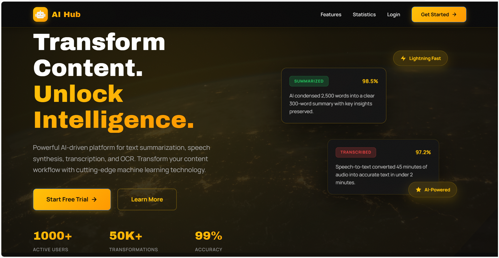
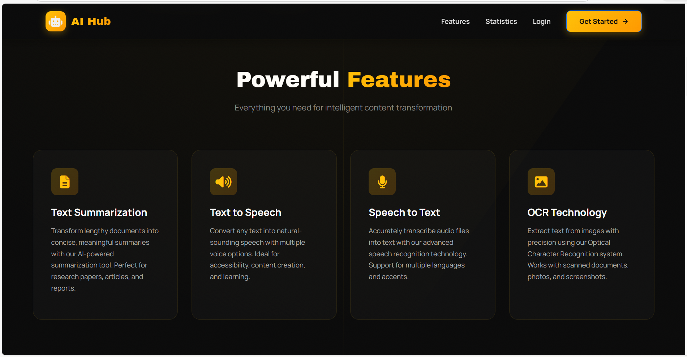

# 🤖 AI-Powered Content Transformation Hub

A modern, full-stack web application that provides AI-powered content transformation features such as **Text Summarization, Text-to-Speech, Speech-to-Text, and OCR**, along with secure user authentication and profile management.

<div align="center">

[](https://www.python.org/)
[](https://flask.palletsprojects.com/)
[](https://developer.mozilla.org/en-US/docs/Web/HTML)
[](https://developer.mozilla.org/en-US/docs/Web/CSS)
[](https://getbootstrap.com/)
[](https://developer.mozilla.org/en-US/docs/Web/JavaScript)

[](https://www.sqlite.org/)
[](https://pypi.org/project/sumy/)
[](https://pypi.org/project/gTTS/)
[](https://pypi.org/project/SpeechRecognition/)
[](https://pypi.org/project/pytesseract/)
[](https://werkzeug.palletsprojects.com/)


[Features](#-key-features) • [Installation](#-installation--setup) • [Usage](#-usage-guide) • [Screenshots](#-project-screenshots) • [Documentation](#-documentation)

</div>

---
## 🌟 Overview

**AI Hub** is a modern, full-stack web application that leverages cutting-edge artificial intelligence to provide powerful content transformation tools. Built with Flask and featuring a sleek, responsive UI, this platform offers four core AI-powered features designed to enhance productivity and accessibility.

### 🎯 Mission

To democratize access to AI-powered content transformation tools, making advanced technology accessible to students, professionals, and content creators worldwide.

### 🏆 Why AI Hub?

- ✅ **All-in-One Platform**: Four powerful AI tools in a single application
- ✅ **User-Friendly Interface**: Clean, modern design with intuitive navigation
- ✅ **Secure & Reliable**: Enterprise-grade security with encrypted passwords
- ✅ **Free & Premium Tiers**: Flexible pricing for different user needs
- ✅ **Open Source**: Learn, modify, and contribute to the codebase

---

## Images
- Home page
  


- Powerful Features
  



## ✨ Key Features

### 🔐 1. User Authentication & Security

- User Registration & Login  
- Password hashing using Werkzeug  
- Email verification system  
- Forgot password & reset password functionality  
- Session-based authentication  
- Profile image upload  
- Role-based access (Free / Paid User)

---

### 🧠 2. AI-Powered Features

#### 📝 Text Summarization
- Automatically summarizes long text  
- Uses intelligent sentence selection  
- Supports different text lengths  

#### 🔊 Text-to-Speech (TTS)
- Converts text into downloadable audio  
- Multiple voice options  
- Premium voices for Paid users  
- Audio files auto-managed  

#### 🎙️ Speech-to-Text (STT)
- Upload audio files  
- Converts speech into text  
- Supports multiple audio formats  
- Automatic WAV conversion  

#### 🖼️ Optical Character Recognition (OCR)
- Upload images  
- Extracts readable text using Tesseract OCR  
- Handles clear printed text accurately  

---

### 📊 3. User Dashboard

- Clean and responsive dashboard  
- Animated feature cards  
- Quick navigation to AI tools  
- Profile & account management  

---

## 📁 Project Structure

```
ai_hub_project/
├── app.py                              # Main Flask application
├── database.db                         # SQLite database (auto-created)
├── README.md                           # Project documentation
├── email_verification_template.html    # Email verification template
├── password_reset_template.html        # Password reset email template
│
├── templates/
│   ├── index.html
│   ├── register.html
│   ├── login.html
│   ├── verify_email.html
│   ├── forgot_password.html
│   ├── reset_password.html
│   ├── dashboard.html
│   ├── profile.html
│   ├── summarize.html
│   ├── tts.html
│   ├── stt.html
│   └── ocr.html
│
└── static/
    ├── uploads/                        # User uploads (auto-created)
    ├── audio/                          # Generated TTS audio (auto-created)
    ├── images/
    │   └── login_.png                  # Background image
    └── css/
        └── style.css                   # Custom styles

```

## 🚀 Installation & Setup

### Prerequisites
- Python 3.7 or higher
- pip (Python package manager)

### Step 1: Install Dependencies

```bash
pip install flask
pip install werkzeug
```

### Step 2: Create Project Structure

Create the following folder structure:

```
ai_hub_project/
├── app.py
├── templates/
├── static/
│   ├── css/
│   ├── js/
│   ├── images/
│   └── uploads/
```

### Step 3: Copy Files

1. Copy `app.py` to the root directory
2. Copy all HTML files to `templates/` folder
3. Copy `style.css` to `static/css/` folder
4. Copy `main.js` to `static/js/` folder

### Step 4: Run the Application

```bash
python app.py
```

The application will start at: `http://127.0.0.1:5000/`

## 📝 Usage Guide

### 1. Register an Account
- Go to `http://127.0.0.1:5000/`
- Click on "Register here"
- Fill in your details:
  - Full Name
  - Email
  - Password
  - Role (Free User / Paid User)
  - Profile Image (optional)
- Click "Register"

### 2. Login
- Enter your email and password
- Click "Login"
- You'll be redirected to the dashboard

### 3. Use Features

**Text Summarization:**
- Click on "Summarization" from navbar or dashboard
- Paste your long text
- Click "Generate Summary"
- View the summarized text

**Text to Speech:**
- Click on "Text to Speech"
- Enter your text
- Select voice (Premium voices for paid users)
- Click "Convert to Audio"

**Speech to Text:**
- Click on "Speech to Text"
- Upload an audio file
- Click "Convert to Text"
- View and copy the transcribed text

**OCR:**
- Click on "OCR"
- Upload an image
- Click "Extract Text"
- View and copy the extracted text

### 4. Profile Management
- Click on your name in the navbar
- Select "Profile" from dropdown
- View your account details
- Upgrade to premium (UI only)

## 🎨 UI Features

- **Color Scheme**: Yellow (#f5c518) and Black (#0f0f0f)
- **Responsive Design**: Works on all devices
- **Smooth Animations**: Hover effects and transitions
- **Modern Cards**: Rounded corners with yellow borders
- **Clean Layout**: Easy to navigate
- **Bootstrap Icons**: Professional icon set

## 🔐 Security Features

- Password hashing using werkzeug
- Session-based authentication
- Secure file uploads
- SQL injection prevention

## 📊 Database Schema

### Users Table
```sql
CREATE TABLE users (
    id INTEGER PRIMARY KEY AUTOINCREMENT,
    name TEXT NOT NULL,
    email TEXT UNIQUE NOT NULL,
    password TEXT NOT NULL,
    role TEXT DEFAULT 'Free User',
    profile_image TEXT,
    created_at TIMESTAMP DEFAULT CURRENT_TIMESTAMP
)
```

## 🛠️ Customization

### Change Secret Key
In `app.py`, update:
```python
app.secret_key = 'your-secret-key-change-this-in-production'
```

### Change Colors
In `static/css/style.css`, modify:
```css
:root {
    --primary-yellow: #f5c518;
    --dark-bg: #0f0f0f;
    --card-bg: #1a1a1a;
}
```

### Add Real AI APIs
The current implementation uses placeholder logic. To add real AI features:

1. **For TTS**: Use Google Cloud TTS, Amazon Polly, or gTTS
2. **For STT**: Use Google Cloud Speech-to-Text or Assembly AI
3. **For OCR**: Use Tesseract, Google Vision API, or Azure Computer Vision
4. **For Summarization**: Use OpenAI API, Hugging Face, or custom models

## 📌 Important Notes

1. **Database**: `database.db` is created automatically on first run
2. **Uploads**: Profile images are stored in `static/uploads/`
3. **File Size**: Max upload size is 16MB
4. **AI Features**: Currently use placeholder logic for demonstration
5. **Production**: Change secret key and add proper security measures

## 🐛 Troubleshooting

**Issue: Database error**
- Delete `database.db` and restart the application

**Issue: Import errors**
- Make sure all dependencies are installed: `pip install flask werkzeug`

**Issue: Upload folder not found**
- Create `static/uploads/` folder manually

**Issue: Template not found**
- Check that all HTML files are in the `templates/` folder

## 📚 Future Enhancements

- [ ] Implement real AI APIs
- [ ] Add payment integration for premium users
- [ ] Email verification
- [ ] Password reset functionality
- [ ] Usage analytics
- [ ] File history
- [ ] Export features
- [ ] Multi-language support

## 👨‍💻 Development

This project is designed for college submissions and learning purposes. The code is:
- Well-commented
- Easy to understand
- Beginner-friendly
- Ready for demonstrations

## 📄 License

This project is developed strictly for educational purposes under Savitribai Phule Pune University curriculum.

## 🤝 Support

For any issues or questions, please refer to:
- Flask documentation: https://flask.palletsprojects.com/
- Bootstrap documentation: https://getbootstrap.com/
- SQLite documentation: https://www.sqlite.org/

## ❤️ Acknowledgment

- Created with passion and dedication for academic learning and real-world AI exposure.
---
