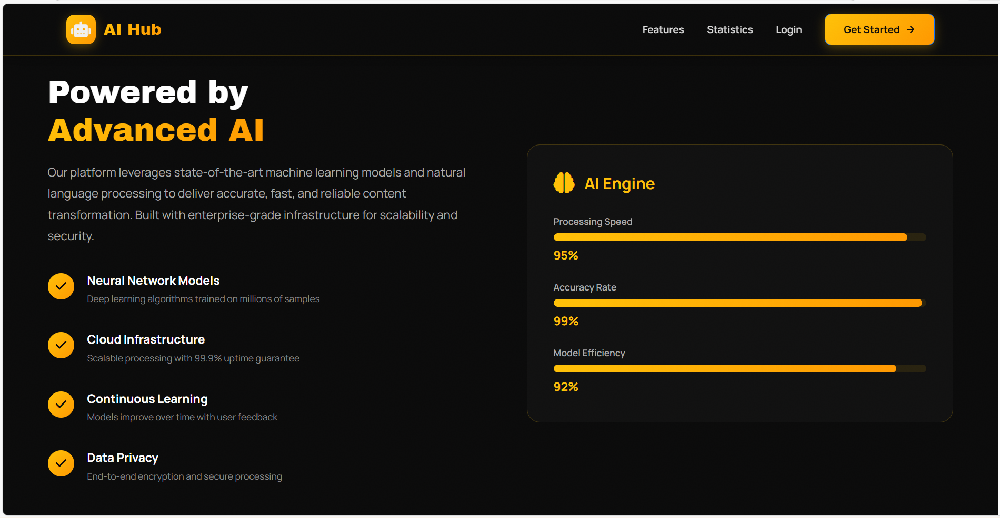
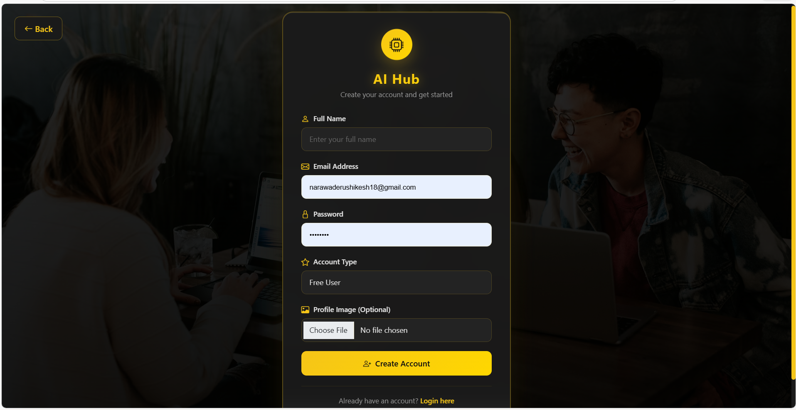
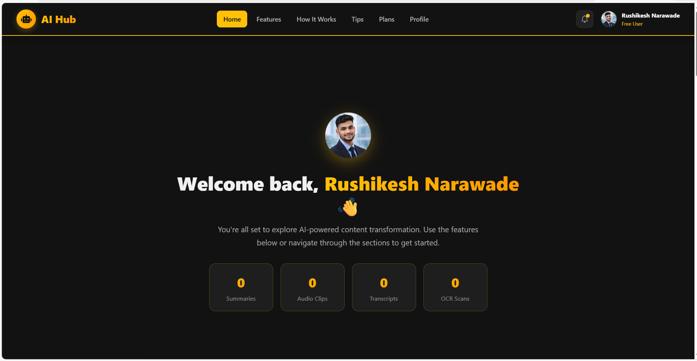
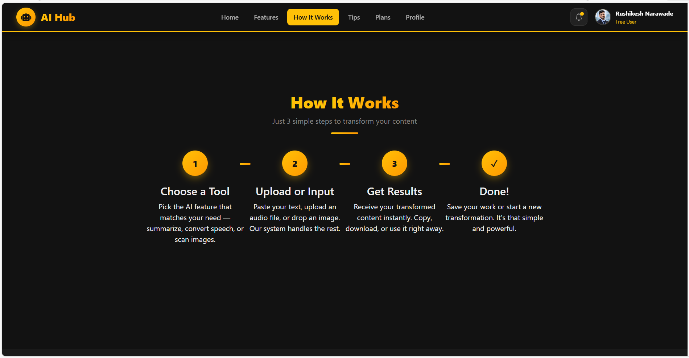
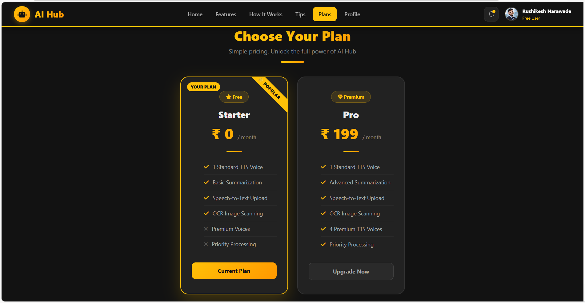
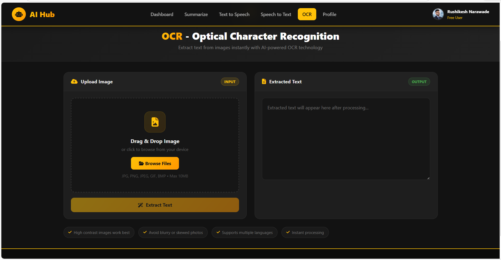
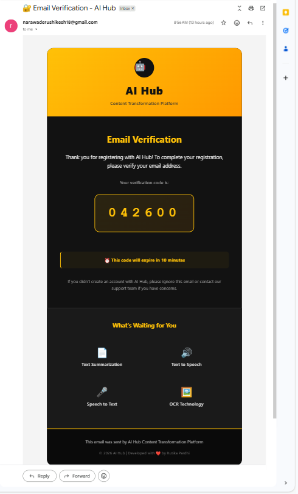

# 🤖 AI-Powered Content Transformation Hub

A modern, full-stack web application that provides AI-powered content transformation features such as **Text Summarization, Text-to-Speech, Speech-to-Text, and OCR**, along with secure user authentication and profile management.

<div align="center">

[](https://www.python.org/)
[](https://flask.palletsprojects.com/)
[](https://developer.mozilla.org/en-US/docs/Web/HTML)
[](https://developer.mozilla.org/en-US/docs/Web/CSS)
[](https://getbootstrap.com/)
[](https://developer.mozilla.org/en-US/docs/Web/JavaScript)

[](https://www.sqlite.org/)
[](https://pypi.org/project/sumy/)
[](https://pypi.org/project/gTTS/)
[](https://pypi.org/project/SpeechRecognition/)
[](https://pypi.org/project/pytesseract/)
[](https://werkzeug.palletsprojects.com/)


[Features](#-key-features) • [Installation](#-installation--setup) • [Usage](#-usage-guide) • [Screenshots](#-project-screenshots) • [Documentation](#-documentation)

</div>

---
## 🌟 Overview

**AI Hub** is a modern, full-stack web application that leverages cutting-edge artificial intelligence to provide powerful content transformation tools. Built with Flask and featuring a sleek, responsive UI, this platform offers four core AI-powered features designed to enhance productivity and accessibility.

### 🎯 Mission

To democratize access to AI-powered content transformation tools, making advanced technology accessible to students, professionals, and content creators worldwide.

### 🏆 Why AI Hub?

- ✅ **All-in-One Platform**: Four powerful AI tools in a single application
- ✅ **User-Friendly Interface**: Clean, modern design with intuitive navigation
- ✅ **Secure & Reliable**: Enterprise-grade security with encrypted passwords
- ✅ **Free & Premium Tiers**: Flexible pricing for different user needs
- ✅ **Open Source**: Learn, modify, and contribute to the codebase

---

## Images
- Home page
  


- Powerful Features
  


- Technology
  


- Login
  


- Register
  


- Dashboard
  


- Tools
  


- Profile
  


- How it works
  


- Tips
  


- Plans
  


- Summerization
  


- Text To Speech
  


- Speech To Text
  


- Extract text from Image
  


# ✨ Key Features

## 🔐 1. User Authentication & Security

- Email verification

 <div align="center"> 
   


 </div>

 - **User Registration** with profile image upload
- **Secure Login** with password hashing (Werkzeug)
- **Email Verification** system (ready for integration)
- **Password Reset** functionality
- **Session Management** for secure access
- **Role-Based Access Control** (Free/Paid users)
- **Profile Management** with editable user information

---

## 🧠 2. AI-Powered Features

#### 📝 Text Summarization
- Automatically summarizes long text  
- Uses intelligent sentence selection  
- Supports different text lengths  

#### 🔊 Text-to-Speech (TTS)
- Converts text into downloadable audio  
- Multiple voice options  
- Premium voices for Paid users  
- Audio files auto-managed  

#### 🎙️ Speech-to-Text (STT)
- Upload audio files  
- Converts speech into text  
- Supports multiple audio formats  
- Automatic WAV conversion  

#### 🖼️ Optical Character Recognition (OCR)
- Upload images  
- Extracts readable text using Tesseract OCR  
- Handles clear printed text accurately  

---

## 📊 3. User Dashboard

- Clean and responsive dashboard  
- Animated feature cards  
- Quick navigation to AI tools  
- Profile & account management  

## 🛠️ Technology Stack

### Backend
- **Framework**: Flask 2.3+
- **Database**: SQLite3
- **Security**: Werkzeug (Password Hashing)
- **Session Management**: Flask-Session

### Frontend
- **HTML5**: Semantic markup
- **CSS3**: Modern styling with animations
- **JavaScript**: Interactive functionality
- **Bootstrap 5.3**: Responsive framework
- **Font Awesome**: Icon library

### AI & Machine Learning
- **Text Summarization**: Sumy (LSA Algorithm)
- **Text-to-Speech**: gTTS (Google Text-to-Speech)
- **Speech-to-Text**: SpeechRecognition
- **OCR**: Pytesseract (Tesseract-OCR)

### Additional Libraries
- **Pillow**: Image processing
- **pydub**: Audio manipulation
- **NLTK**: Natural language processing
- **email-validator**: Email validation
---

## 📁 Project Structure

```
ai_hub_project/
├── app.py                              # Main Flask application
├── database.db                         # SQLite database (auto-created)
├── README.md                           # Project documentation
├── email_verification_template.html    # Email verification template
├── password_reset_template.html        # Password reset email template
│
├── templates/
│   ├── index.html
│   ├── register.html
│   ├── login.html
│   ├── verify_email.html
│   ├── forgot_password.html
│   ├── reset_password.html
│   ├── dashboard.html
│   ├── profile.html
│   ├── summarize.html
│   ├── tts.html
│   ├── stt.html
│   └── ocr.html
│
└── static/
    ├── uploads/                        # User uploads (auto-created)
    ├── audio/                          # Generated TTS audio (auto-created)
    ├── images/
    │   └── login_.png                  # Background image
    └── css/
        └── style.css                   # Custom styles

```


## 🚀 Installation & Setup

### Prerequisites

Before you begin, ensure you have the following installed:
- **Python 3.7+** ([Download](https://www.python.org/downloads/))
- **pip** (Python package manager)
- **Git** (optional, for cloning)

### Step 1: Clone or Download the Repository

```bash
# Option 1: Clone with Git
git clone https://github.com/yourusername/ai-hub.git
cd ai-hub

# Option 2: Download ZIP and extract
# Then navigate to the extracted folder
cd ai-hub-main
```

### Step 2: Install Dependencies

```bash
pip install -r requirements.txt
```

**Required packages:**
```
Flask==2.3.0
Werkzeug==2.3.0
Pillow==10.0.0
sumy==0.11.0
nltk==3.8.1
gTTS==2.3.2
SpeechRecognition==3.10.0
pytesseract==0.3.10
pydub==0.25.1
email-validator==2.0.0
```

### Step 3: Install Tesseract OCR (for OCR feature)

**Windows:**
1. Download from: https://github.com/UB-Mannheim/tesseract/wiki
2. Install and add to PATH

**macOS:**
```bash
brew install tesseract
```

**Linux:**
```bash
sudo apt-get install tesseract-ocr
```

### Step 4: Download NLTK Data (for Summarization)

```python
python -c "import nltk; nltk.download('punkt'); nltk.download('stopwords')"
```

### Step 5: Create Required Directories

```bash
mkdir -p static/uploads static/audio docs/images
```

### Step 6: Configure Application

Edit `app.py` and update:
```python
# Change this in production!
app.secret_key = 'your-super-secret-key-change-in-production'

# Optional: Configure upload settings
app.config['MAX_CONTENT_LENGTH'] = 16 * 1024 * 1024  # 16MB max file size
```

### Step 7: Run the Application

```bash
python app.py
```

**Success!** The application should now be running at:
```
🌐 http://127.0.0.1:5000/
```

### Step 8: Create First Account

1. Navigate to `http://127.0.0.1:5000/`
2. Click "Get Started" or "Register"
3. Fill in your details
4. Start using AI Hub!

---

## 🔗 API Endpoints

### Authentication Routes

| Method | Endpoint | Description | Auth Required |
|--------|----------|-------------|---------------|
| GET | `/` | Landing page | No |
| GET/POST | `/register` | User registration | No |
| GET/POST | `/login` | User login | No |
| GET | `/logout` | User logout | Yes |
| GET/POST | `/forgot-password` | Password recovery | No |
| GET/POST | `/reset-password/<token>` | Reset password | No |

### Feature Routes

| Method | Endpoint | Description | Auth Required |
|--------|----------|-------------|---------------|
| GET | `/dashboard` | User dashboard | Yes |
| GET | `/profile` | User profile | Yes |
| POST | `/update-profile` | Update profile | Yes |
| GET/POST | `/summarize` | Text summarization | Yes |
| GET/POST | `/tts` | Text-to-speech | Yes |
| GET/POST | `/stt` | Speech-to-text | Yes |
| GET/POST | `/ocr` | OCR processing | Yes |

---


## 🐛 Troubleshooting

**Issue: Database error**
- Delete `database.db` and restart the application

**Issue: Import errors**
- Make sure all dependencies are installed: `pip install flask werkzeug`

**Issue: Upload folder not found**
- Create `static/uploads/` folder manually

**Issue: Template not found**
- Check that all HTML files are in the `templates/` folder

## 📚 Future Enhancements

- [ ] Implement real AI APIs
- [ ] Add payment integration for premium users
- [ ] Email verification
- [ ] Password reset functionality
- [ ] Usage analytics
- [ ] File history
- [ ] Export features
- [ ] Multi-language support

## 👥 Contributing

We welcome contributions from the community! Here's how you can help:

### How to Contribute

1. **Fork the Repository**
   ```bash
   git clone https://github.com/yourusername/ai-hub.git
   ```

2. **Create a Feature Branch**
   ```bash
   git checkout -b feature/AmazingFeature
   ```

3. **Make Your Changes**
   - Write clean, commented code
   - Follow existing code style
   - Test your changes thoroughly

4. **Commit Your Changes**
   ```bash
   git commit -m "Add some AmazingFeature"
   ```

5. **Push to Branch**
   ```bash
   git push origin feature/AmazingFeature
   ```

6. **Open a Pull Request**
   - Describe your changes
   - Reference any related issues
   - Wait for review

### Contribution Guidelines

- Follow PEP 8 style guide for Python
- Write meaningful commit messages
- Add comments for complex logic
- Update documentation as needed
- Test before submitting PR

### Code of Conduct

- Be respectful and inclusive
- Accept constructive criticism
- Focus on what's best for the community
- Show empathy towards others

---

## 📄 License

This project is licensed under the **MIT License** - see the [LICENSE](LICENSE) file for details.

```
MIT License

Copyright (c) 2026 Rushikesh Narawade

Permission is hereby granted, free of charge, to any person obtaining a copy
of this software and associated documentation files (the "Software"), to deal
in the Software without restriction, including without limitation the rights
to use, copy, modify, merge, publish, distribute, sublicense, and/or sell
copies of the Software, and to permit persons to whom the Software is
furnished to do so, subject to the following conditions:

The above copyright notice and this permission notice shall be included in all
copies or substantial portions of the Software.

THE SOFTWARE IS PROVIDED "AS IS", WITHOUT WARRANTY OF ANY KIND, EXPRESS OR
IMPLIED, INCLUDING BUT NOT LIMITED TO THE WARRANTIES OF MERCHANTABILITY,
FITNESS FOR A PARTICULAR PURPOSE AND NONINFRINGEMENT. IN NO EVENT SHALL THE
AUTHORS OR COPYRIGHT HOLDERS BE LIABLE FOR ANY CLAIM, DAMAGES OR OTHER
LIABILITY, WHETHER IN AN ACTION OF CONTRACT, TORT OR OTHERWISE, ARISING FROM,
OUT OF OR IN CONNECTION WITH THE SOFTWARE OR THE USE OR OTHER DEALINGS IN THE
SOFTWARE.
```

---

## 🙏 Acknowledgments

### Special Thanks

- **Flask Community** - Excellent framework and documentation
- **Open Source Contributors** - For amazing libraries and tools
- **Beta Testers** - For valuable feedback and bug reports


- Created with passion and dedication for academic learning and real-world AI exposure.
---
